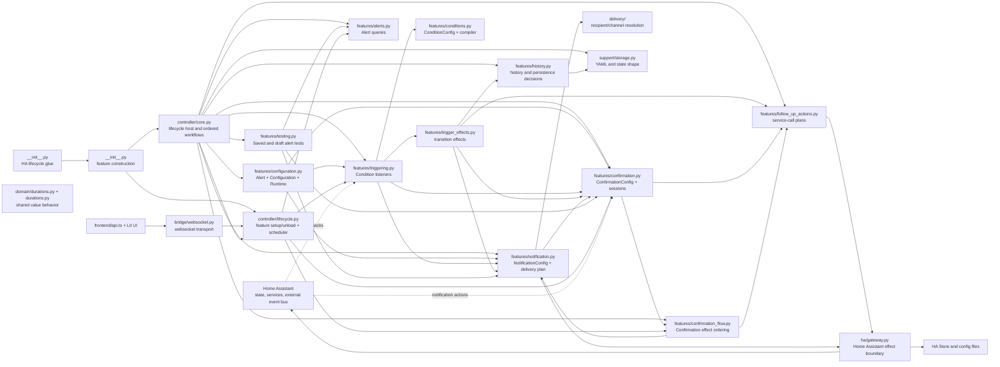

# Architecture overview

HA Notifications uses a small controller composition root, direct feature workflows, and one Home Assistant gateway. Home Assistant's own event bus remains an external integration boundary for startup, notification actions, template changes, and timers. The private application EventBus has been removed.

## Layer map

## Ownership rules

- `__init__.py` constructs and attaches the feature lifecycle. `controller/core.py` hosts integration lifecycle and shared runtime state but never constructs, initializes, configures, or unloads individual features. `controller/lifecycle.py` owns generic feature setup/unload ordering, rollback, annotated feature/websocket-route dispatch, and the task scheduler.
- `ha/gateway.py` is the only module that imports Home Assistant APIs. It provides typed service, template, registry, persistence, watcher, panel, and websocket capabilities.
- `bridge/websocket.py` generates Home Assistant handlers from feature websocket-route declarations and handles HA connection/result serialization. Legacy controller operations remain only until their owning features are migrated; it remains a transport adapter, not a domain router.
- `features/alerts.py` owns `AlertFeature`, its `alerts.list` and `alerts.save` routes, runtime-state projection, alert validation, timestamps, and reload request.
- `features/alerts.py` owns typed alerts and `AlertRuntime`; other features request alert runtime through its lifecycle route instead of constructing generic trigger state.
- `features/triggering.py` owns condition listeners, watcher registration, startup/reload/interval/template callbacks, and transition decisions. It does not normalize frontend values, own alert state, or apply delivery/history effects.
- `features/trigger_effects.py` owns the ordered effects after a transition: confirmation tracking, notification delivery, history recording, follow-up actions, and runtime persistence.
- `features/confirmation.py` owns confirmation sessions, its Home Assistant action subscription, matching, and resolution into confirmation facts.
- `features/testing.py` owns saved-alert and draft test delivery, draft confirmation sessions, TTL expiry, disposal, and its websocket routes.
- `features/confirmation_flow.py` owns ordered reactions to a confirmation fact. It requests notification delivery planning, history recording, and follow-up execution but owns none of their state or composition rules.
- `features/notification.py` owns message composition, send/clear planning, confirmation clear/completion delivery planning, and `NotificationSchedule` repeat/resend policy; `features/confirmation.py` owns the alert-level confirmation configuration; `delivery/` owns recipient and channel resolution.
- `features/follow_up_actions.py` owns post-send and post-confirmation action planning.
- `domain/template_values.py` owns recursive configuration-template rendering and null removal before service calls.
- `features/history.py` owns history entry formatting, queries, deletion cleanup, recording, and runtime history mutation. Workflows call it directly; history does not depend on subscriber ordering.
- `features/configuration.py` owns the flat `Alert`, `Configuration`, and `AlertRuntime` models because they compose the persisted document and runtime boundary. `Alert` inherits the empty `AlertFeatureConfig` marker and preserves feature sections as extra fields; each feature validates its own section at its workflow boundary, keeping feature ownership out of the configuration model. `domain/` contains only shared value behavior.
- `features/triggering.py` owns `MonitorConfig`, watcher settings, and trigger decisions.
- `features/notification.py` owns `NotificationConfig`, target normalization, confirmation resend policy, and delivery planning.
- `features/confirmation.py` owns `ConfirmationConfig` and confirmation sessions; `features/confirmation_flow.py` owns confirmation effect ordering.
- `features/conditions.py` owns condition-editor validation and pure condition compilation.
- `support/storage.py` owns configuration document loading, validation, and saving; core only sequences reload after a feature requests it.
- `support/scheduler.py` owns background task tracking and lifecycle cleanup for feature-scheduled work.
- Feature models remain Pydantic objects at feature boundaries. Mapping output is
    created only at YAML/websocket edges with `model_dump()`.
- Confirmation runtime workflows receive typed configuration objects at their
    feature boundaries; session and effect payloads are separate runtime data.
- Triggering owns its watcher resources through `TriggeringFeature`; pure trigger
    decisions remain ordinary functions because they have no lifecycle resources.
- Follow-up action rendering validates each action as a feature-owned object;
    malformed actions remain isolated as typed `ActionResult` errors.
- `support/storage.py` owns YAML parsing/dumping and runtime-state shape repair without interpreting feature behavior.

## Dependencies and validation

Features receive narrow typed capabilities and may depend only on explicitly declared lower-level capabilities. There is no service locator, generic plugin framework, or application-wide router. Dependencies must remain acyclic.

Pydantic v2 models own feature configuration defaults, field limits, coercion, and feature-specific validation. `Alert` owns the typed alert graph, while explicit `model_dump()` calls preserve YAML and websocket shapes. Voluptuous remains at the Home Assistant websocket envelope boundary. Whole-document configuration coordination handles only document shape and cross-feature invariants, delegating field semantics to the owning feature.

Invalid configuration is validated before any file write, so invalid YAML cannot replace the last valid configuration. The canonical YAML shape keeps alert-level confirmation separate from notification content; public websocket contracts remain stable.

## Workflow contracts

- Trigger evaluation mutates runtime state first. A condition transition records
    its active/inactive history, then sends the notification, records send success
    or failure, runs enabled follow-up actions sequentially, and persists state.
    Delivery failures are recorded and stop that delivery attempt; they do not
    run follow-up actions.
- Clearing a pending notification happens before removal or inactive-state
    completion. Clear failures are logged and do not prevent the owning alert or
    history cleanup from continuing.
- Confirmation validates the action session and runtime action ID before marking
    an alert confirmed. It records confirmation, clears the notification when
    configured, attempts an optional completion notification, records completion
    success or failure, runs confirmation follow-up actions, and persists state.
    Stale or unknown actions are ignored.
- Reload loads and validates configuration, unloads existing feature watchers,
    applies the new alert set, configures watchers, rebuilds persisted
    confirmation sessions, and then evaluates newly enabled or reload-eligible
    alerts. The reload lock serializes concurrent reloads.
- Unload removes external listeners, unloads feature watchers, cancels and
    awaits lifecycle-managed feature tasks, unregisters the frontend panel, persists runtime
    state, and resets the setup guard. Setup failure uses the same unload path to
    roll back resources created before the failure.

## Lifecycle

1. The composition module constructs the gateway host and feature lifecycle.
2. Core loads persisted state and coordinates configuration reload.
3. Features configure their watchers, runtime resources, and scheduled jobs.
4. Core registers external Home Assistant listeners and the frontend transport.
5. Startup/reload callbacks call direct awaited feature workflows.
6. Unload removes external listeners, unconfigures watchers, cancels and awaits lifecycle-managed jobs, unregisters frontend resources, and persists state.

Partial setup failures must unwind resources already created. Feature cleanup is idempotent.

## Adding a feature

Add a focused feature module or package containing its configuration model, validation, workflow, and tests. Declare a public async method with `@route("feature.operation")` when the frontend needs it; lifecycle discovery constructs it from its declared dependencies. Do not modify core to initialize a feature or add a global event vocabulary. Add a websocket command only when the feature needs a new public operation; preserve the existing transport boundary.

## Testing

Pure feature decisions use plain data tests. Controller tests use one fake gateway and verify ordering, persistence, watcher cleanup, reload, confirmation, delivery, and error handling. Backend changes require `python3 -m pytest tests/`; frontend changes additionally require the frontend build and test commands in `docs/todo.md`.
