# Architecture overview

Notification Center is a small kernel plus a set of self-registering
feature plugins. One module, `ha/gateway.py`, is the only thing allowed
to call Home Assistant. `controller/core.py` owns lifecycle and is the only thing
`bridge/` calls for its
public, one-shot operations (save/delete/test/YAML). Everything reactive
(condition changes, notification outcomes, confirmations, follow-up
actions, history) flows through `controller/bus.py`'s `EventBus`: core
publishes plain-data facts, `features/*.py` modules subscribe to the
facts they care about and return `Command`s (including further events,
which cascade). Feature modules never import `ha.gateway`, never import
`controller.core`, and never call each other directly - every read they
need (HA state, runtime state, sessions) comes from asking the bus; gateway
queries are answered by `ha/gateway.py`, and in-memory queries by `core.py`.

For symptom-driven debugging, use [`.github/logic-index.md`](../.github/logic-index.md).
This document is the structural map and must be updated whenever modules are
added, split, moved, renamed, or given a new responsibility.

## Layer Map

```mermaid
flowchart TB
    subgraph HA["Home Assistant"]
        HASS[("hass state, services, event bus")]
        Store[(".storage/notification_center")]
        FrontendHost["HA frontend resource loader"]
    end

    subgraph Shell["Integration shell"]
        Init["__init__.py\nminimal HA lifecycle glue"]
        ConfigFlow["config_flow.py"]
    end

    subgraph Bridge["bridge/ (3 files)"]
        Validation["validation.py\nnormalize + validate"]
        WS["websocket.py\nregisters 12 commands\n(HA's own dispatch = the router)"]
        PanelPy["panel.py (pure)\nregistration_plan -> PanelRegistrationPlan"]
    end

    subgraph Domain["domain/ (shared, boundary-agnostic)"]
        Models["alert_schema.py\nnormalize_alert()"]
        Conditions["condition_schema.py\ncompile_condition()"]
        Durations["durations.py\nparse/format"]
    end

    subgraph Kernel["controller/ package - the kernel only"]
      Core["core.py\nowns lifecycle state,\nEventBus wiring, setup, public API"]
        Commands["commands.py\nCallService / TrackTemplate / TrackInterval /\nUnsubscribe / PersistSave / Emit / RunBatch"]
        Events["events.py\nshared Event + event/query name vocabulary"]
      Bus["bus.py\nEventBus: publish + execute + ask"]
    end

    subgraph Features["features/ package - self-registering plugins"]
      Alerts["triggering.py (pure decisions + thin bus adapter)\nregister_specs -> [Command]\non_condition_result -> TriggerTransition"]
      Responses["confirmation.py (pure decisions + thin bus adapter)\ntrack / clear / match_action_event / plan_confirmation_effects"]
      ActionsPy["follow_up_actions.py (pure decisions + thin bus adapter)\nbuild_service_calls -> [ActionResult]"]
      Notifications["notification.py (pure decisions + thin bus adapter)\ncompose_send / compose_clear -> [Command]"]
      History["history.py (bus listener only)\nrecords facts via support/history.py"]
      Rendering["rendering.py (pure)\nrender_value / remove_none"]
      NotificationRoutes["notification_services/\ntargets + targeted + Mobile App"]
    end

    StorageMod["support/storage.py (pure)\nYAML (de)serialization + state shape repair"]

    subgraph Gateway["ha/gateway.py — imported ONLY by core.py"]
        GW["HomeAssistantGateway"]
    end

    subgraph Front["Frontend (Lit)"]
        ApiTs["frontend/api.ts"]
        PanelTs["frontend/panel.ts + editor/*"]
    end

    PanelTs --> ApiTs
    ApiTs -- "notification_center/*" --> WS
    FrontendHost -. "registered by core using panel.py's plan" .-> Core
    Init --> Core
    ConfigFlow --> HASS

    WS --> Validation --> Core
    Validation --> Models
    Validation --> Conditions

    Core -- "publish(Event)" --> Bus
    Bus -- "dispatch to subscribers" --> Alerts
    Bus -- "dispatch to subscribers" --> Responses
    Bus -- "dispatch to subscribers" --> Notifications
    Bus -- "dispatch to subscribers" --> ActionsPy
    Bus -- "dispatch to subscribers" --> History

    Alerts -. "[Command] (Emit/RunBatch/...)" .-> Bus
    Responses -. "[Command]" .-> Bus
    Notifications -. "[Command]" .-> Bus
    ActionsPy -. "[Command]" .-> Bus
    History -. "[PersistSave]" .-> Bus
   Bus -- "HA-facing leaf Commands" --> GW

    Alerts -- "ask(GET_ALERT/GET_STATE/...)" --> Bus
    Responses -- "ask(GET_SESSIONS/GET_RUNTIME_STATE/...)" --> Bus
    Notifications -- "ask(RENDER_TEMPLATE/FETCH_REGISTRY_SNAPSHOT/...)" --> Bus
    Bus -- "respond(alert/runtime/session queries)" --> Core
    Bus -- "respond(template/service/registry/condition queries)" --> GW

    Notifications --> NotificationRoutes
    Notifications --> Rendering
    ActionsPy --> Rendering
    Responses --> Rendering

    Core -- "normalize_and_validate_yaml / normalize_and_dump_yaml" --> StorageMod
    StorageMod --> Models
    Core -- "registration_plan" --> PanelPy

    Core --> GW
    GW --> HASS
    GW --> Store
   GW -- "register responders + listeners" --> Bus
```

Only `Core` (`controller/core.py`) constructs `GW` (`ha/gateway.py`); no
other module imports it. `GW` additionally registers itself as the bus's
responder for its own passthrough queries (`RENDER_TEMPLATE`/`HAS_SERVICE`/
`FETCH_REGISTRY_SNAPSHOT`/`EVALUATE_CONDITION`/`GET_STATES`), so those reads never
pass through `Core`.
`Commands`/`Events` are a shared vocabulary - importing them is not
coupling, same as before. The key shift from the previous design: arrows
between `Core` and `features/*` now all go *through* `Bus`, and `Core`
never imports a feature module's decision functions to sequence a
reactive flow - it only calls each feature's `register(bus)` once at
setup and answers the few read queries only it can answer. Feature
modules still never call each other directly; when one feature's outcome
matters to another (e.g. "a notification was just sent" mattering to both
`triggering.py`'s bookkeeping and `follow_up_actions.py`'s post-send
actions and `history.py`'s recording), they all independently subscribe to
the same fact event instead of one calling the other.

The public control-plane methods remain on `core.py` because the websocket
bridge needs immediate return values and errors. Their reactive effects still
use the bus: config application publishes `ALERT_CONFIGURED`, test delivery
publishes `NOTIFICATION_SEND_REQUESTED`, confirmation sessions use session
events, and delete publishes `NOTIFICATION_CLEAR_REQUESTED` plus `PersistSave`.
Pure YAML/history reads and transformations remain direct calls.

## Dependency Rules

Code should flow downward through the owning interface, not sideways through
internal helpers.

| Concern | Entry point | Rule |
| --- | --- | --- |
| Frontend to backend communication | `frontend/api.ts` | This is the only frontend module allowed to call `hass.connection.sendMessagePromise`. UI modules import API functions, not websocket message names. |
| Backend frontend-facing operations | `controller/core.py` (`NotificationCenterController`) | `bridge/websocket.py` calls the controller's public methods directly. It never reaches into `features/` modules for these, and it never imports `ha.gateway`. |
| Home Assistant access | `ha/gateway.py` (`HomeAssistantGateway`) | The *only* module that imports `homeassistant.*`. It is constructed only by `controller/core.py`. Features obtain HA reads through gateway-owned bus responders (`RENDER_TEMPLATE`, `HAS_SERVICE`, `FETCH_REGISTRY_SNAPSHOT`, `EVALUATE_CONDITION`, `GET_STATES`) and issue typed commands through gateway-owned listeners. `core.py` answers only in-memory queries (`GET_ALERT`, `GET_RUNTIME_STATE`, `GET_STATE`, `GET_SESSIONS`). |
| Config normalization | `domain/alert_schema.py` (`ConfigNormalizer`/`normalize_config`) | Owns the shared alert document shape, conditions, durations, and YAML safety. Unknown alert and notification fields are preserved for feature-owned extensions; do not add feature-specific field handling here unless it is a shared boundary invariant. |
| Condition compilation | `domain/condition_schema.py` (`compile_condition`) | The only place visual conditions become Jinja template text. |
| The event bus | `controller/bus.py` (`EventBus`) | Generic publish/execute/ask dispatch only - no business logic. It interprets `Emit`/`RunBatch` orchestration and dispatches typed leaf commands to registered listeners. |
| The kernel | `controller/core.py` | Owns lifecycle state, gateway/bus construction, in-memory query responders, setup/reload sequencing, and the public control-plane API. Business decisions and HA command dispatch must not leak in here. |
| Trigger state machine | `features/triggering.py` | Owns alert configuration watcher commands and "when does an alert fire": condition/interval specs plus active/acknowledged/repeat transitions, translated into condition and notification facts. Also records send outcomes and confirmations. |
| Confirmation/session tracking | `features/confirmation.py` | Owns the one pending-session table (real alerts and unsaved test drafts alike), incoming mobile-action-event routing (`action.received`), and confirmation-effect planning (`alert.confirmed_effects` -> clear/completion/follow-up requests). |
| Follow-up actions | `features/follow_up_actions.py` (`build_service_calls`) | Renders an alert's configured extra service calls in response to `notification.sent` (post-send) and `actions.run_requested` (post-confirmation); per-action errors are isolated via one `RunBatch` per action so one bad action doesn't stop the others. |
| Notification composition | `features/notification.py` (`compose_send`/`compose_clear`) | Reacts to `notification.send_requested`/`notification.clear_requested`, composing message content and `CallService` commands. Delegates recipient expansion plus targeted and Mobile App service selection to `features/notification_services/`; those components return plain resolution data, never gateway calls. |
| History recording | `features/history.py` | A bus *listener*, not a kernel primitive - subscribes to the same fact events other features emit (including `NOTIFICATION_TEST_SENT`, published by `test_alert`) and turns them into entries via `support/history.py`, persisted with the ordinary `PersistSave` command. `core.py` has no history-writing logic of its own; it only reads (`get_history`) and removes (`delete_alert`) via `support/history.py`'s pure helpers. |
| Alert payload construction | `frontend/alert-payload.ts` | Editor sections mutate form state; this module converts form values into the saved `Alert` payload. |

## Frontend Shape

The frontend is authored with Lit:

- `frontend/panel.ts` is a `LitElement` shell for the dashboard and Lovelace card.
- Editor, history, YAML, condition builder, and recipient picker render through Lit
  templates and Lit's `render(...)` helper.
- `frontend/api.ts` is the transport boundary. Adding a new backend operation
  means adding a typed wrapper there first, then using that wrapper from UI code.
- `frontend/types.ts` is the shared contract surface. UI modules should not invent
  incompatible local shapes for alerts, registries, history entries, or runtime
  state.

## Backend Shape

The backend has four levels:

1. **Integration shell** (`__init__.py`, `config_flow.py`) receives Home
   Assistant lifecycle events and hands off to the controller immediately.
2. **Frontend bridge** (`bridge/`) is the one frontend-facing
   interface: normalize/validate, then call the controller. `bridge/panel.py`
   also builds the pure frontend-registration plan `core.py` uses at setup.
3. **Controller kernel** (`controller/`) is `core.py` (gateway, Command
   interpreter, public API), `commands.py`/`events.py` (shared vocabulary),
   and `bus.py` (the generic `EventBus`).
4. **Feature plugins** (`features/`) - `triggering.py`/`confirmation.py`/
   `notification.py`/`follow_up_actions.py`/`history.py` - each owns one
   reactive concern, self-registers its event subscriptions via
   `register(bus)`, and never touches Home Assistant or another feature
   module directly.
5. **Home Assistant boundary** (`ha/gateway.py`) is the only module that
   actually talks to Home Assistant, called only by `controller/core.py`.

`support/storage.py` and `support/history.py` are pure support modules
(`storage.py` called directly by the controller; `history.py` called by
`features/history.py`); `domain/` is shared schema/condition/duration logic
used by both the frontend bridge and the controller/features layers.

## Testing Shape

Because almost everything is pure, most modules need **no Home Assistant
fakes at all** - test them with plain data in, plain data/`Command`s out
(`tests/test_triggering.py`, `tests/test_confirmation.py`,
`tests/test_notification.py`, `tests/test_follow_up_actions.py`,
`tests/test_history_feature.py`, `tests/test_event_bus.py`,
`tests/test_storage.py`, `tests/test_history.py`, `tests/test_models.py`).
`controller/core.py` needs exactly one fake (`HomeAssistantGateway`) -
`tests/test_controller_core.py` is the golden-path integration test
(save -> watch -> send -> respond) using a hand-built fake gateway, wired
through the real `EventBus` and every feature module's real `register(bus)`.

## Refactor Checklist

When changing a boundary:

1. Update this document and [`.github/logic-index.md`](../.github/logic-index.md).
2. Keep the public entry point stable or update all callers in the same change.
3. Run `python3 -m pytest tests/` for backend/runtime changes.
4. Run `npm run build && npm run test:frontend` for frontend changes.
5. Preserve YAML safety: invalid input must not replace the last known valid
   saved configuration (enforced in `controller/core.py`'s `save_yaml` -
   `storage.normalize_and_validate_yaml` runs, and can raise, before any
   file write happens).

## Adding a New Feature

Each feature is an isolated file under `features/` with two parts: pure
decision functions (plain data in, plain data/`Command`s out - identical
in spirit to before) and a thin `register(bus)` + `handle_*` adapter layer
that subscribes to events and asks the bus for whatever it needs. This
still supports adding new backend functionality without restructuring the
kernel. `controller/bus.py` remains a closed dispatcher over
`commands.py`'s fixed `Command` vocabulary
(`CallService`/`TrackTemplate`/`TrackInterval`/`Unsubscribe`/`PersistSave`/
`Emit`/`RunBatch`) with no generic "run anything" escape hatch.

To add a new feature:

1. **Backend logic**: add a new `features/<feature>.py` module. Its
   decision functions take plain data in and return plain data/`Command`s
   out, same as before. Add a `register(bus)` function and one or more
   `async def handle_*(event, bus)` adapters that subscribe to the fact
   events it cares about, `await bus.ask(...)` for anything it needs
   (HA-touching reads or the runtime-state/session dicts - never `hass`
   itself), and return the `Command`s (including `Emit`s of new fact
   events) for the kernel to execute. It never imports another feature
   module and never imports `ha.gateway`.
2. **Wiring**: add the module to `controller/core.py`'s `_FEATURE_MODULES`
   tuple so `async_setup` calls its `register(bus)` - this is the one
   place the plugin set is visible/auditable. If the feature needs a new
   read the kernel doesn't already answer, add one query name to
   `events.py` and one responder method to `core.py`.
3. **Frontend-triggered?** Add one handler in `bridge/websocket.py`
   (parse `msg` -> validate via `bridge/validation.py` if it carries a
   payload -> call the new `controller/core.py` method -> return the
   result) and one typed wrapper in `frontend/api.ts`.
4. **New persisted fields?** Add them to `domain/alert_schema.py`'s
   normalizer so every entry point (save, draft test, YAML import, reload)
   normalizes the new field consistently - never build a one-off
   normalization path outside it.
5. **New UI?** Add a component under `frontend/` (or `frontend/features/`
   once the per-feature frontend split lands) and wire it through
   `frontend/api.ts`, never constructing websocket messages directly.
6. Update this document and `.github/logic-index.md` if the new module
   introduces a new boundary or changes an existing one's responsibility.

Notification delivery follows one additional rule: shared target expansion and
`DeliveryType` classification stay in
`features/notification_services/targets.py`; targeted notification service
selection lives in `targeted.py`; Mobile App entry-name and service resolution
lives in `mobile_app.py`. Closely related
lookup helpers stay together rather than being split into nested files.
`features/notification.py` remains the one composer interface reached via
`notification.send_requested`/`notification.clear_requested`.

