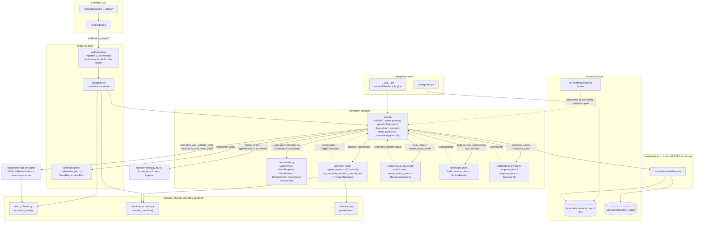

# Architecture overview

Notification Center is a small kernel plus a set of pure modules. One module,
`ha/gateway.py`, is the only thing allowed to call Home Assistant. One module,
`controller/core.py`, is the only thing that calls the gateway and the only
thing `bridge/` calls. Every other module is pure: it takes plain
data (and occasionally an injected callable like `render`) in, and returns
plain data (or a `Command` describing an intent) out - it never imports
`ha.gateway` and never imports `controller.core`.

For symptom-driven debugging, use [`.github/logic-index.md`](../.github/logic-index.md).
This document is the structural map and must be updated whenever modules are
added, split, moved, renamed, or given a new responsibility.

## Layer Map

Only `Core` (`controller/core.py`) touches `GW` (`ha/gateway.py`). `Commands`
is a shared vocabulary of plain dataclasses - importing it is not coupling.
Every arrow out of `Alerts`/`Responses`/`ActionsPy`/`Notifications` goes back
up to `Core`, never sideways to each other: sending, clearing, and running
follow-up actions are always decisions `core.py` makes after consulting a
pure module, never decisions a pure module makes on its own.

## Dependency Rules

Code should flow downward through the owning interface, not sideways through
internal helpers.

| Concern | Entry point | Rule |
| --- | --- | --- |
| Frontend to backend communication | `frontend/api.ts` | This is the only frontend module allowed to call `hass.connection.sendMessagePromise`. UI modules import API functions, not websocket message names. |
| Backend frontend-facing operations | `controller/core.py` (`NotificationCenterController`) | `bridge/websocket.py` calls the controller's public methods directly. It never reaches into `alerts.py`/`responses.py`/`notifications.py`/`actions.py`, and it never imports `ha.gateway`. |
| Home Assistant access | `ha/gateway.py` (`HomeAssistantGateway`) | The *only* module that imports `homeassistant.*`. It is constructed and called only by `controller/core.py`. No other module - not even `support/storage.py`/`bridge/panel.py` - imports it. |
| Config normalization | `domain/alert_schema.py` (`ConfigNormalizer`/`normalize_config`) | Save, draft, validation, storage, and reload paths normalize before acting. Do not build one-off config wrappers outside the normalizer. |
| Condition compilation | `domain/condition_schema.py` (`compile_condition`) | The only place visual conditions become Jinja template text. |
| Trigger state machine | `controller/alerts.py` | Owns "when does an alert fire": condition/interval watch specs, and the active/acknowledged/repeat decision logic, returned as a `TriggerTransition` for `core.py` to act on. Never calls `notifications.py`/`actions.py` itself. |
| Confirmation/session tracking | `controller/responses.py` | Owns the one pending-session table (real alerts and unsaved test drafts alike) and incoming mobile-action-event routing. |
| Follow-up actions | `controller/actions.py` (`build_service_calls`) | Renders an alert's configured extra service calls; per-action errors are isolated so one bad action doesn't stop the others. |
| Notification composition | `controller/notifications.py` (`compose_send`/`compose_clear`) | The only place that decides message content, recipients, and delivery route (including legacy Mobile App fallback). Returns `Command`s; never calls the gateway itself. |
| The kernel | `controller/core.py` | Owns the gateway, the generic `_execute(Command)` dispatcher, and the sequencing glue between pure modules. Business decisions must not leak in here - if `_execute`'s dispatcher or `core.py`'s sequencing methods grow real decision logic, that logic belongs in a pure module instead. |
| Alert payload construction | `frontend/alert-payload.ts` | Editor sections mutate form state; this module converts form values into the saved `Alert` payload. |

## Frontend Shape

The frontend is authored with Lit:

- `frontend/panel.ts` is a `LitElement` shell for the dashboard and Lovelace card.
- Editor, history, YAML, condition builder, and recipient picker render through Lit
  templates and Lit's `render(...)` helper.
- `frontend/api.ts` is the transport boundary. Adding a new backend operation
  means adding a typed wrapper there first, then using that wrapper from UI code.
- `frontend/types.ts` is the shared contract surface. UI modules should not invent
  incompatible local shapes for alerts, registries, history entries, or runtime
  state.

## Backend Shape

The backend has four levels:

1. **Integration shell** (`__init__.py`, `config_flow.py`) receives Home
   Assistant lifecycle events and hands off to the controller immediately.
2. **Frontend bridge** (`bridge/`) is the one frontend-facing
   interface: normalize/validate, then call the controller. `bridge/panel.py`
   also builds the pure frontend-registration plan `core.py` uses at setup.
3. **Controller** (`controller/`) is the brain: `core.py` is the kernel;
   `alerts.py`/`responses.py`/`actions.py`/`notifications.py` are pure
   decision/composition modules it calls into.
4. **Home Assistant boundary** (`ha/gateway.py`) is the only module that
   actually talks to Home Assistant, called only by `controller/core.py`.

`support/storage.py` and `support/history.py` are pure
support modules the
controller calls directly; `domain/` is shared schema/condition/duration
logic used by both the frontend bridge and the controller.

## Testing Shape

Because almost everything is pure, most modules need **no Home Assistant
fakes at all** - test them with plain data in, plain data/`Command`s out
(`tests/test_controller_alerts.py`, `tests/test_controller_responses.py`,
`tests/test_controller_notifications.py`, `tests/test_controller_actions.py`,
`tests/test_storage.py`, `tests/test_history.py`, `tests/test_models.py`).
`controller/core.py` needs exactly one fake (`HomeAssistantGateway`) -
`tests/test_controller_core.py` is the golden-path integration test
(save -> watch -> send -> respond) using a hand-built fake gateway.

## Refactor Checklist

When changing a boundary:

1. Update this document and [`.github/logic-index.md`](../.github/logic-index.md).
2. Keep the public entry point stable or update all callers in the same change.
3. Run `python3 -m pytest tests/` for backend/runtime changes.
4. Run `npm run build && npm run test:frontend` for frontend changes.
5. Preserve YAML safety: invalid input must not replace the last known valid
   saved configuration (enforced in `controller/core.py`'s `save_yaml` -
   `storage.normalize_and_validate_yaml` runs, and can raise, before any
   file write happens).

## Adding a New Feature

The existing module-per-concern split
(`controller/alerts.py`/`responses.py`/`notifications.py`/`actions.py`,
each pure, each returning `Command`s for `core.py` to execute) already
supports adding new backend functionality as an isolated file, without
restructuring the kernel. `controller/core.py`'s `_execute(command)` is a
closed dispatcher over `commands.py`'s fixed `Command` vocabulary
(`CallService`/`TrackTemplate`/`TrackInterval`/`Unsubscribe`/`PersistSave`)
with no generic "run anything" escape hatch - a new feature either fits
that vocabulary already, or earns one new `Command` dataclass plus one new
`isinstance` branch in `_execute`.

To add a new feature:

1. **Backend logic**: add a new pure `controller/<feature>.py` module. It
   takes plain data in (and injected callables like `render`/`has_service`
   where it needs to ask something of Home Assistant, never `hass`
   itself), and returns `Command`s (or a small result dataclass, like
   `TriggerTransition`/`ResponseOutcome`) for `core.py` to act on. It never
   calls another pure module directly and never imports `ha.gateway`.
2. **Wiring**: `controller/core.py` gets one new method that sequences
   calls into the new module and executes the `Command`s it returns - the
   same pattern as `_on_condition_result`/`_send_notification`. This is
   sequencing glue only; no decisions belong in `core.py` itself.
3. **Frontend-triggered?** Add one handler in `bridge/websocket.py`
   (parse `msg` -> validate via `bridge/validation.py` if it carries a
   payload -> call the new `controller/core.py` method -> return the
   result) and one typed wrapper in `frontend/api.ts`.
4. **New persisted fields?** Add them to `domain/alert_schema.py`'s
   normalizer so every entry point (save, draft test, YAML import, reload)
   normalizes the new field consistently - never build a one-off
   normalization path outside it.
5. **New UI?** Add a component under `frontend/` (or `frontend/features/`
   once the per-feature frontend split lands) and wire it through
   `frontend/api.ts`, never constructing websocket messages directly.
6. Update this document and `.github/logic-index.md` if the new module
   introduces a new boundary or changes an existing one's responsibility.

