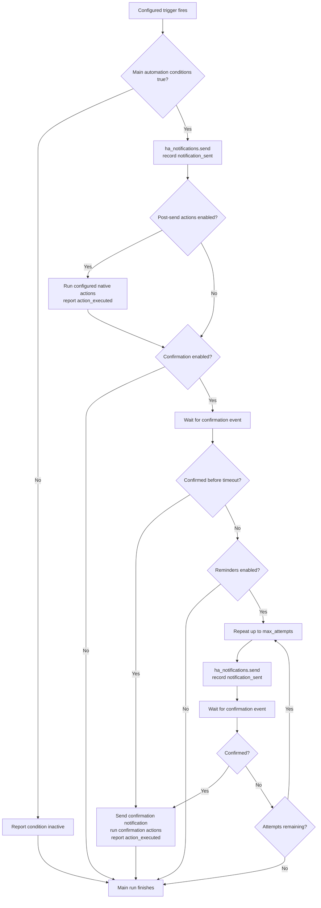

# Automation Flow

The generated automation is assembled from the canonical alert configuration.
Only enabled features contribute actions to the YAML. The `ha_notifications`
services record managed delivery, lifecycle events, and native action results
in persistent history through the `report` service; `logbook.log` is included
only when configured as a post-send action.
The persistent history store belongs to the loaded config entry's
`runtime_data`; it is not kept in `hass.data`.

Generated automations are written to the dedicated
`ha_notifications_automations.yaml` include. Add this to Home Assistant's
`configuration.yaml`:

```yaml
automation ha_notifications: !include ha_notifications_automations.yaml
```

This named automation entry is unique to HA Notifications and can coexist with
your other automation configuration. The integration adds this include
automatically when it is missing. Restart Home Assistant after the first
automatic insertion so the new configuration is loaded.

Generated automations are grouped in the Home Assistant automation category
and carry the HA Notifications label. Action history is reported with the
`action_executed` status. If a user manually edits or replaces an owned
automation, that attribution guarantee no longer applies.

Each alert selects a Home Assistant automation mode: `single` ignores new
triggers while a run is active, `restart` cancels the current run and starts a
fresh one, `queued` runs triggers sequentially, and `parallel` starts
independent runs. The default for new or unspecified alerts is `parallel`;
existing saved mode choices are preserved. Parallel runs do not cancel an
in-progress confirmation wait when another trigger fires.
Conditional alerts use `parallel` mode so an inactive evaluation does not
interrupt an in-progress confirmation wait. The main generated automation
keeps exactly the enabled configured triggers, including user-supplied IDs and
`for` durations. Optional alert conditions gate its send actions; with no
conditions, each configured trigger runs the actions. Startup and time-pattern
triggers can therefore be used alone for unconditional checks, or combined
with conditions to gate those checks on current state.
An explicit Home Assistant `automation.trigger` call with `skip_condition: true`
bypasses that gate and runs the main actions; it does not infer an inactive
transition.
The built-in Startup trigger runs at Home Assistant startup, and the Repeat
trigger performs interval checks; custom Home Assistant triggers add other
event sources. Conditions do not create triggers: they are evaluated only when
a configured custom, Startup, or Repeat trigger fires. For a conditional alert,
the same triggers also evaluate the conditions negated and report inactive when
they are false. This condition-evaluation report remains in the main automation
without cancelling waits or clearing notifications. Conditions are not continuously
monitored, and no reverse state edge or door-closing watcher is inferred. An
explicitly configured closing trigger remains a normal main trigger, with its
original ID and duration; it is not repurposed as a completion handler.

Each alert generates its main automation; without enabled main triggers it
generates no automations. Automation mode belongs to `monitor.automation_mode`,
not to individual triggers. Nested mode settings and retired options are rejected.
The **Inactive** child section under **When to run** optionally defines native
triggers in `monitor.inactive.items`. When enabled and nonempty, these generate
a separate queued automation that records inactivity and sends `cancel_run` to
pending confirmation waits. Its triggers bypass main alert conditions and mode.
The optional `clear_notification` setting also clears the delivered notification.
Disabled inactive settings are preserved but do not generate an automation.
No inverse triggers or automation-completion listeners are inferred.
Notifications default to the alert ID as their `data.tag`, so providers that
support tagged replacement update the previous notification for that alert.
User-supplied tags are preserved. Finishing or stopping a run does not clear a
delivered notification. Use `ha_notifications.clear` explicitly when needed.

The Active view only includes automations whose live Home Assistant `current`
run count is nonzero. A last-triggered status or an outstanding notification
does not by itself mean the automation is active.

The panel's **Cancel active runs** action stops current actions for the alert's
generated automation. It restores the automation only when the saved alert is
enabled and records the stopped runs as cancelled. A notification already sent
by a stopped run remains delivered; cancelling a run does not clear it.



The `ha_notifications.command` service fires an alert-scoped
`ha_notifications_command` event. The generated confirmation wait currently
handles `skip_confirmation` by resolving the wait as a timeout, so configured
reminders and the normal timeout outcome still apply; it does not record a
confirmation. The explicit `cancel_run` command cancels matching confirmation
waits; inactive history reports do not emit it.
The panel's Cancel active runs action emits `cancel_run` before stopping the
automation, so confirmation waits wake immediately and terminate as cancelled.
The generic command event can be extended with more commands without adding a
new event type for each operation.

```yaml
service: ha_notifications.command
data:
    alert_id: kitchen
    command: skip_confirmation
```