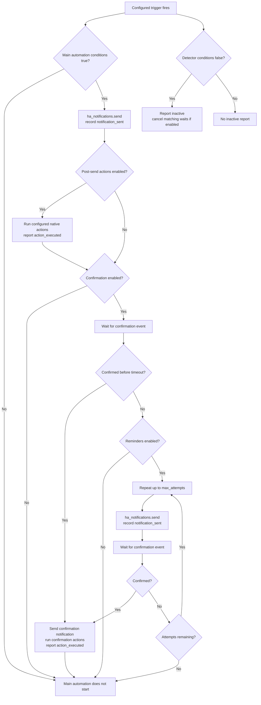

# Automation Flow

The generated automation is assembled from the canonical alert configuration.
Only enabled features contribute actions to the YAML. The `ha_notifications`
services record managed delivery, lifecycle events, and native action results
in persistent history through the `report` service; `logbook.log` is included
only when configured as a post-send action.
The persistent history store belongs to the loaded config entry's
`runtime_data`; it is not kept in `hass.data`.

Generated automations are written to the dedicated
`ha_notifications_automations.yaml` include. Add this to Home Assistant's
`configuration.yaml`:

```yaml
automation ha_notifications: !include ha_notifications_automations.yaml
```

This named automation entry is unique to HA Notifications and can coexist with
your other automation configuration. The integration adds this include
automatically when it is missing. Restart Home Assistant after the first
automatic insertion so the new configuration is loaded.

Generated automations are grouped in the Home Assistant automation category
and carry the HA Notifications label. Action history is reported with the
`action_executed` status. If a user manually edits or replaces an owned
automation, that attribution guarantee no longer applies.

Each alert selects a Home Assistant automation mode: `single` ignores new
triggers while a run is active, `restart` cancels the current run and starts a
fresh one, `queued` runs triggers sequentially, and `parallel` starts
independent runs. The default for new or unspecified alerts is `parallel`;
existing saved mode choices are preserved. Parallel runs do not cancel an
in-progress confirmation wait when another trigger fires.
Every configured trigger starts the main generated automation. Optional alert
conditions are applied as top-level conditions before its actions; with no
conditions, each configured trigger runs the actions. Startup and time-pattern
triggers can therefore be used alone for unconditional checks, or combined
with conditions to gate those checks on current state.
An explicit Home Assistant `automation.trigger` call with `skip_condition: true`
bypasses that gate and runs the main actions; it does not trigger the separate
inactive detector.
The built-in Startup trigger runs at Home Assistant startup, and the Repeat
trigger performs interval checks; custom Home Assistant triggers add other
event sources. A state trigger targeting `on` or `off` is sufficient for
event-driven alerts without a duplicate state condition. When conditions are
configured, the **When conditions change** option derives state triggers from
referenced entities and template triggers from entity-backed template
conditions. Static templates need Startup, periodic, or custom event triggers.
A separate detector watches entity-backed condition changes and checks the
conditions negated to report inactive, independently of the main automation's
condition-change trigger option. It also watches referenced entities for
template conditions. When **Cancel on inactive** under **When to run > Triggers**
is enabled, inferred reverse edges are added for binary state triggers. When
Conditions are configured, the condition-inactive detector watches those edges
and reports inactive only while the conditions are false. Without Conditions,
the reverse edge is handled by an inactive branch in the main automation; it
does not resend the alert, and no trigger-inactive automation is generated.
A configured `for` duration is mirrored on the reverse edge, so both
transitions use the same debounce period. Event, Startup, and time-pattern
triggers have no general inverse. The condition-inactive detector is
independent of the main automation's selected `single`, `restart`, `queued`, or
`parallel` mode. For conditionless alerts, the inverse branch runs under the
main automation's selected mode. Inactive is recorded once when the
alert enters a false-condition period; repeated inactive evaluations are
deduplicated, so an alert that starts while false still gets one history entry.
A real active-to-inactive transition also ends confirmation waits as cancelled
when enabled and removes the alert from the panel's Active view. Initial
inactive evaluations do not cancel waits. This does not clear a notification
already delivered to a device; notifications can still be cleared explicitly
with the `ha_notifications.clear` service.
The **When to run** setting **Cancel on inactive** controls only
wait cancellation. Inactive history is still recorded when the setting is off.
The setting remains available even without configured Conditions and defaults
to off when missing from a saved alert.
The Active view only includes automations whose live Home Assistant `current`
run count is nonzero. A last-triggered status or an outstanding notification
does not by itself mean the automation is active.

The panel's **Cancel active runs** action stops current actions for the alert's
generated automation. It restores the automation only when the saved alert is
enabled and records the stopped runs as cancelled. A notification already sent
by a stopped run remains delivered; cancelling a run does not clear it.



The `ha_notifications.command` service fires an alert-scoped
`ha_notifications_command` event. The generated confirmation wait currently
handles `skip_confirmation` by resolving the wait as a timeout, so configured
reminders and the normal timeout outcome still apply; it does not record a
confirmation. On an active-to-inactive transition, the integration emits the
internal `cancel_run` command to cancel matching confirmation waits.
The panel's Cancel active runs action emits `cancel_run` before stopping the
automation, so confirmation waits wake immediately and terminate as cancelled.
The generic command event can be extended with more commands without adding a
new event type for each operation.

```yaml
service: ha_notifications.command
data:
    alert_id: kitchen
    command: skip_confirmation
```