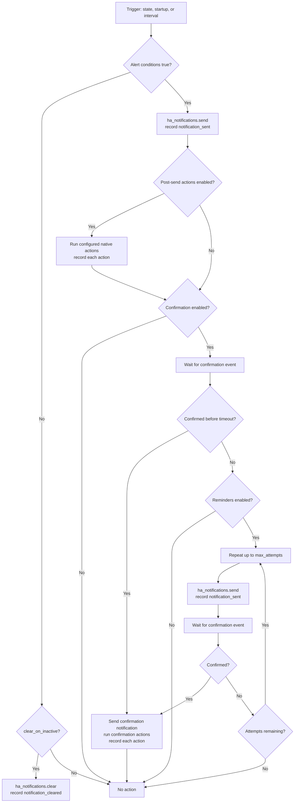

# Automation Flow

The generated automation is assembled from the canonical alert configuration.
Only enabled features contribute actions to the YAML. The `ha_notifications`
services record managed delivery and native action results in persistent
history; `logbook.log` is included only when configured as a post-send action.
The persistent history store belongs to the loaded config entry's
`runtime_data`; it is not kept in `hass.data`.

Generated automations are written to the dedicated
`ha_notifications_automations.yaml` include. Add this to Home Assistant's
`configuration.yaml`:

```yaml
automation ha_notifications: !include ha_notifications_automations.yaml
```

This named automation entry is unique to HA Notifications and can coexist with
your other automation configuration. The integration adds this include
automatically when it is missing. Restart Home Assistant after the first
automatic insertion so the new configuration is loaded.

Generated automations are attributable because HA Notifications adds its own
metadata and record actions. If a user manually edits or replaces an owned
automation, that attribution guarantee no longer applies.

