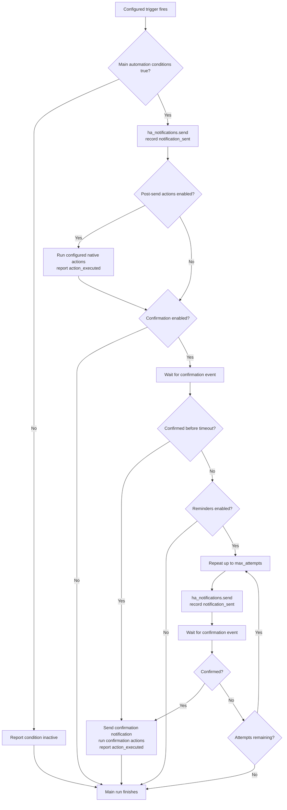

# Automation Flow

## Notification Payload Shape

Saved alerts contain canonical `title`, `message`, and `options` alongside the
destination. This also applies to `confirmation.notification`, whose explicit
`enabled` switch controls follow-up delivery:

```yaml
notification:
    target:
        device_id: [phone_device_id]
    title: Motion Detected in Backyard
    message: Someone might be in the backyard.
    use_default_tag: true
    options:
        color: "#2DF56D"
        persistent: true
```

After resolving the recipient target, Home Assistant receives the same content
inside the notify action's outer service-call `data` envelope:

```yaml
action: notify.mobile_app_phone
data:
    title: Motion Detected in Backyard
    message: Someone might be in the backyard.
    data:
        color: "#2DF56D"
        persistent: true
        tag: alert_id
```

Native `{title, message, data: options}` is built only at the transport boundary.
Device options retain their values, with the alert ID added as the default tag
only when `use_default_tag` is true (the default). Set it to false at the
notification level to omit that default and keep separate notifications. A
custom `options.tag` is always preserved; no random tag is generated.
Android `subject` and iOS `subtitle` remain native
device options. Unknown options and template values are not coerced. Values remain
saved in `options` even when disabled. Optional `option_controls` stores group and
field enablement separately; the backend omits disabled paths only from generated
delivery payloads, never from saved configuration. Without controls, native options
are sent unchanged. Root `mobile_options` remains unsupported.

```yaml
notification:
    title: Door open
    message: The door is open.
    options:
        channel: Security
        push:
            sound: default
            badge: 0
    option_controls:
        android:
            enabled: false
            fields:
                channel: true
        ios:
            enabled: true
            fields:
                push.sound: false
                push.badge: true
```

This retains all three values in storage but sends only `push.badge: 0` from
these controlled options. Group disablement excludes every path declared in that
group. Field disablement excludes only that path. Uncontrolled native extensions
remain untouched. The editor records all its managed paths when a group is toggled,
so it can be saved, reopened, and enabled without losing values. The same contract
applies to confirmation follow-up options. Option controls are integration metadata,
not Companion App data.

Generated `ha_notifications.send` and `clear` use this service contract:

```yaml
action: ha_notifications.send
data:
    alert_id: backyard
    alert_name: Backyard motion
    use_default_tag: true
    flow_id: "{{ context.parent_id or context.id }}"
    target:
        device_id: [phone_device_id]
    payload:
        title: Motion Detected in Backyard
        message: Someone might be in the backyard.
        data:
            color: "#2DF56D"
            persistent: true
```

`action` is an optional service-level destination. `confirmation` and
`history_reason` are optional integration metadata, as is `use_default_tag`
(boolean, default true); these never enter `payload` or device options.
Only `payload` reaches notify. Clear overrides the message with
`clear_notification` and uses the same tag policy as send. Direct service calls
must use the same `use_default_tag` and custom tag as the original send. Without
either the default or a custom tag, clear cannot identify a previous push.
Android persistent notifications require a tag. Changing the setting does not
retag an earlier push. Confirmation messages are raw-protected until the send service renders
`payload.message`; native options are never stripped for rendering. Follow-up
recipients inherit from the main notification unless explicitly overridden.
The follow-up's own `use_default_tag` defaults to true independently of the main
notification; reminders reuse the main notification's value. Both editors expose
the setting.

Retired notification wrappers and persisted editor metadata are rejected, not
adapted. Existing stored alerts require an explicit canonical update; nothing
automatically rewrites or resets the user's config-entry data.

Post-confirmation actions remain saved in `confirmation.actions` when disabled.
`confirmation.actions_enabled: false` prevents the backend from generating those
actions. When the flag is omitted, the configured action list is enabled.

## Generated Automations

The generated automation is assembled from the canonical alert configuration.
Only enabled features contribute actions to the YAML. The `ha_notifications`
services record managed delivery, lifecycle events, and native action results
in persistent history through the `report` service; `logbook.log` is included
only when configured as a post-send action.
The persistent history store belongs to the loaded config entry's
`runtime_data`; it is not kept in `hass.data`.

Generated automations are written to the dedicated
`ha_notifications_automations.yaml` include. Add this to Home Assistant's
`configuration.yaml`:

```yaml
automation ha_notifications: !include ha_notifications_automations.yaml
```

This named automation entry is unique to HA Notifications and can coexist with
your other automation configuration. The integration adds this include
automatically when it is missing. Restart Home Assistant after the first
automatic insertion so the new configuration is loaded.

Generated automations are grouped in the Home Assistant automation category
and carry the HA Notifications label. Action history is reported with the
`action_executed` status. If a user manually edits or replaces an owned
automation, that attribution guarantee no longer applies.

Each alert selects a Home Assistant automation mode: `single` ignores new
triggers while a run is active, `restart` cancels the current run and starts a
fresh one, `queued` runs triggers sequentially, and `parallel` starts
independent runs. The default for new or unspecified alerts is `parallel`;
existing saved mode choices are preserved. Parallel runs do not cancel an
in-progress confirmation wait when another trigger fires.
Conditional alerts use `parallel` mode so an inactive evaluation does not
interrupt an in-progress confirmation wait. The main generated automation
keeps exactly the enabled configured triggers, including user-supplied IDs and
`for` durations. Optional alert conditions gate its send actions; with no
conditions, each configured trigger runs the actions. Startup and time-pattern
triggers can therefore be used alone for unconditional checks, or combined
with conditions to gate those checks on current state.
An explicit Home Assistant `automation.trigger` call with `skip_condition: true`
bypasses that gate and runs the main actions; it does not infer an inactive
transition.
The built-in Startup trigger runs at Home Assistant startup, and the Repeat
trigger performs interval checks; custom Home Assistant triggers add other
event sources. Conditions do not create triggers: they are evaluated only when
a configured custom, Startup, or Repeat trigger fires. For a conditional alert,
the same triggers also evaluate the conditions negated and report inactive when
they are false. This condition-evaluation report remains in the main automation
without cancelling waits or clearing notifications. Conditions are not continuously
monitored, and no reverse state edge or door-closing watcher is inferred. An
explicitly configured closing trigger remains a normal main trigger, with its
original ID and duration; it is not repurposed as a completion handler.

Startup and interval checks belong to `monitor.conditions`. Interval enablement
and its configured duration are saved together:

```yaml
monitor:
    conditions:
        enabled: true
        items: []
        startup: false
        interval:
            enabled: false
            value: 43200
```

The interval defaults to disabled with a 12-hour value. Disabling interval checks
retains the duration; disabling Conditions retains the interval's own enablement
and value, but neither startup nor interval checks contribute triggers while the
parent is disabled. Native duration forms such as `"01:00:00"` or `{ hours: 1 }`
remain valid interval values. The editor's periodic switch writes `interval.enabled`,
not a persisted `periodic` field. The retired sibling flag and flat interval shape
are rejected by the backend; the frontend does not migrate them automatically.

Each alert always generates its main automation; without enabled main triggers
it has an empty trigger list and runs only when started manually, such as by
**Test alert**. Automation mode belongs to `monitor.automation_mode`,
not to individual triggers. Nested mode settings and retired options are rejected.
The **Inactive** child section under **When to run** optionally defines native
triggers in `monitor.inactive.items`. When enabled and nonempty, these generate
a separate queued automation that records inactivity and sends `cancel_run` to
pending confirmation waits. Its triggers bypass main alert conditions and mode.
The optional `clear_notification` setting also clears the delivered notification.
Disabled inactive settings are preserved but do not generate an automation.
No inverse triggers or automation-completion listeners are inferred.
Notifications default to the alert ID as their `data.tag`, so providers that
support tagged replacement update the previous notification for that alert.
Set `notification.use_default_tag: false` to omit the managed tag.
User-supplied tags are preserved. Finishing or stopping a run does not clear a
delivered notification. Use `ha_notifications.clear` explicitly when needed.

The Active view only includes automations whose live Home Assistant `current`
run count is nonzero. A last-triggered status or an outstanding notification
does not by itself mean the automation is active.

The panel's **Cancel active runs** action stops current actions for the alert's
generated automation. It restores the automation only when the saved alert is
enabled and records the stopped runs as cancelled. A notification already sent
by a stopped run remains delivered; cancelling a run does not clear it.



The `ha_notifications.command` service fires an alert-scoped
`ha_notifications_command` event. The generated confirmation wait currently
handles `skip_confirmation` by resolving the wait as a timeout, so configured
reminders and the normal timeout outcome still apply; it does not record a
confirmation. The explicit `cancel_run` command cancels matching confirmation
waits; inactive history reports do not emit it.
The panel's Cancel active runs action emits `cancel_run` before stopping the
automation, so confirmation waits wake immediately and terminate as cancelled.
The generic command event can be extended with more commands without adding a
new event type for each operation.

```yaml
service: ha_notifications.command
data:
    alert_id: kitchen
    command: skip_confirmation
```